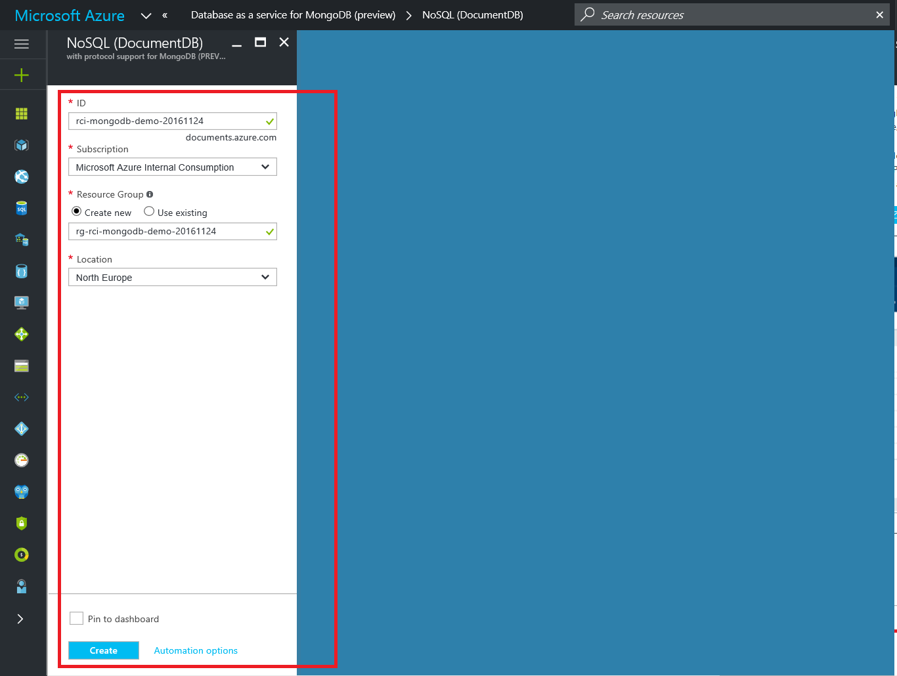
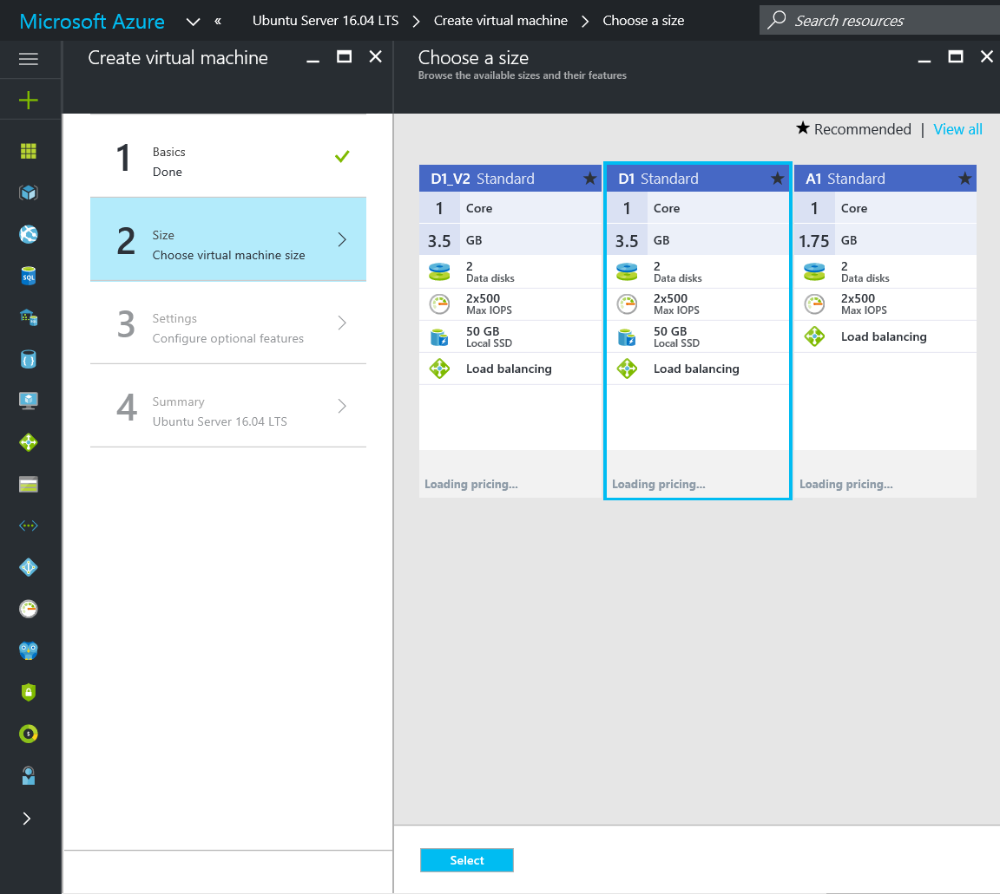
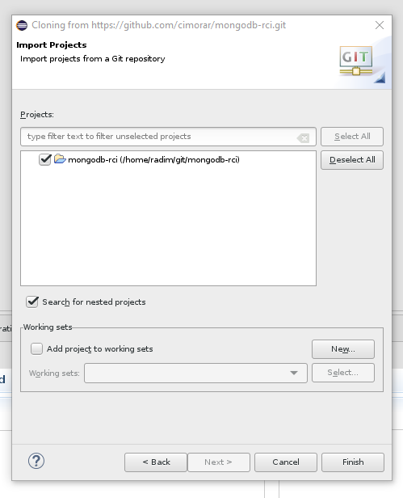

## Overview
This lab demonstrates Azure DocumentDB protocol support for MongoDB, which allows very easy migration of application using MongoDB to Azure DocumentDB. DocumentDB is powerful Azure PaaS NoSQL which offers some advantages compared with MongoDB.
See more <https://azure.microsoft.com/en-us/services/documentdb/>

The lab consists of:
* Spinning up DocumentDB PaaS service with MongoDB support, which is currently in Public Preview
* Deploying Linux Ubuntu VM
* Installing mongodb-org-shell package to Linux VM
* Accessing Azure DocumentDB using mongo shell command line client
* Optional part: Running a Java App with MongoDB driver connecting to Azure DocumentDB using MongoDB API


## Pre-Requisites
* Access to Azure Portal with a right to deploy and use Azure services
* For optional part (Java Application with MongoDB driver), you need Java Development Environment with following or similar components installed:
 * Java JDK
 * OS running CentOS Linux release 7.2.1511 (Core) or similar
```shell
[radim@localhost mongodb-rci]$ java -version
openjdk version "1.8.0_102"
openJDK Runtime Environment (build 1.8.0_102-b14)
OpenJDK 64-Bit Server VM (build 25.102-b14, mixed mode)
```
 * Maven for Java project management
```shell
[radim@localhost mongodb-rci\]$ mvn --version
Apache Maven 3.0.5 (Red Hat 3.0.5-16)
Maven home: /usr/share/maven
Java version: 1.7.0\_111, vendor: Oracle Corporation
Java home: /usr/lib/jvm/java-1.7.0-openjdk-1.7.0.111-2.6.7.2.el7\_2.x86\_64/jre
Default locale: en\_US, platform encoding: UTF-8
OS name: "linux", version: "3.10.0-327.36.1.el7.x86\_64", arch: "amd64", family: "unix"
[radim@localhost mongodb-rci\]$
```
 * Eclipse IDE for Java Developers, e.g. Neon.1a (4.6.1)
```shell
[radim@localhost Downloads\]$ ls ec\*
eclipse-java-neon-1a-linux-gtk-x86\_64.tar.gz
[radim@localhost Downloads\]$
```
## Laboratory section(s) ##

### Step 1 - DocumentDB PaaS service deployment using Azure Portal ###
* Provision Database as a service for MongoDB (preview) in Azure Portal


* Complete the provisioning process as suggested in the screenshot below. Make sure you use unique ID for your DocumentDB instance. DB deployment starts upon click on CREATE button


* In Azure portal, navigate to specific Resource Group (RG) you have created as a part of the deployment process, e.g. **rg-rci-mongodb-demo-20161124**


As a part of this resource group, your DocumentDB instance should be deployed and visible in the overview section.

* By click4 on the DB instance in the RG **Overview** section, you open the DB instance ribbon, which gives you access to various DB PaaS options. Click on **Connection string** in order to open the form with connection parameters. Make sure you note all of them down for this demo purposes.


### Step 2 - VM deployment with MongoDB client using Azure Portal
* From Azure Marketplace, deploy VM image by Canonical with Ubuntu 16.04 LTS Linux. There will be later installed mongo shell command line client which will be used in this demo.


* Deploy VM image to your subscription with.


* Select the desired size of the VM image. Recommended VM Size is D1.


* Keep most settings to default for sake of simplicity


* Check the deployment in the Summary step and confirm 


* Once VM with MongoDB app is deployed you may SSH to it using username and password you have provided in during provisioning process. IP address can be obtained from VM ribbon, **Overview** section upon deployment completion.


### Step 4 - Working with DocumentDB using Mongo command line client

* This section assumes:
 * You have successfully deployed DocumentDB with MongoDB protocol interface support as explained in the previous section
 * You have successfully deployed Linux VM Ubuntu 16.04 LTS by Canonical and you can SSH to this VM

* Next, SSH to your Ubuntu VM and run following commands in order to enable MongoDB package repository which will allow us MongoDB binaries. In the final step you deploy mongo shell command line.
```shell
$ sudo apt-key adv --keyserver hkp://keyserver.ubuntu.com:80 --recv 0C49F3730359A14518585931BC711F9BA15703C6
$ echo "deb http://repo.mongodb.org/apt/ubuntu xenial/mongodb-org/testing multiverse" | sudo tee /etc/apt/sources.list.d/mongodb-org-3.4.list
$ sudo apt-get update
$ sudo apt-get install -y mongodb-org-shell
```

The whole procedure should generate following output:
```shell
[radim@localhost Downloads]$ ssh radim@13.93.124.224
The authenticity of host '13.93.124.224 (13.93.124.224)' can't be established.
ECDSA key fingerprint is 80:55:d5:02:4d:db:39:6b:5e:e7:6a:5c:8b:f1:23:ef.
Are you sure you want to continue connecting (yes/no)? yes
Warning: Permanently added '13.93.124.224' (ECDSA) to the list of known hosts.
radim@13.93.124.224's password:
Welcome to Ubuntu 16.04.1 LTS (GNU/Linux 4.4.0-47-generic x86_64)

 * Documentation:  https://help.ubuntu.com
 * Management:     https://landscape.canonical.com
 * Support:        https://ubuntu.com/advantage

  Get cloud support with Ubuntu Advantage Cloud Guest:
    http://www.ubuntu.com/business/services/cloud

0 packages can be updated.
0 updates are security updates.


The programs included with the Ubuntu system are free software;
the exact distribution terms for each program are described in the
individual files in /usr/share/doc/*/copyright.

Ubuntu comes with ABSOLUTELY NO WARRANTY, to the extent permitted by
applicable law.

To run a command as administrator (user "root"), use "sudo <command>".
See "man sudo_root" for details.

radim@20161124-vm-mongodbclient:~$ sudo apt-key adv --keyserver hkp://keyserver.ubuntu.com:80 --recv 0C49F3730359A14518585931BC711F9BA15703C6
Executing: /tmp/tmp.lsSmt3EIPM/gpg.1.sh --keyserver
hkp://keyserver.ubuntu.com:80
--recv
0C49F3730359A14518585931BC711F9BA15703C6
gpg: requesting key A15703C6 from hkp server keyserver.ubuntu.com
gpg: key A15703C6: public key "MongoDB 3.4 Release Signing Key <packaging@mongodb.com>" imported
gpg: Total number processed: 1
gpg:               imported: 1  (RSA: 1)

radim@20161124-vm-mongodbclient:~$ echo "deb http://repo.mongodb.org/apt/ubuntu xenial/mongodb-org/testing multiverse" | sudo tee /etc/apt/sources.list.d/mongodb-org-3.4.list
deb http://repo.mongodb.org/apt/ubuntu xenial/mongodb-org/testing multiverse
radim@20161124-vm-mongodbclient:~$ sudo apt-get update
Hit:1 http://azure.archive.ubuntu.com/ubuntu xenial InRelease
Get:2 http://azure.archive.ubuntu.com/ubuntu xenial-updates InRelease [102 kB]
***** Some output omitted ****
Fetched 10.9 MB in 4s (2,612 kB/s)
Reading package lists... Done

radim@20161124-vm-mongodbclient:~$ sudo apt-get install -y mongodb-org-shell
Reading package lists... Done
Building dependency tree
Reading state information... Done
The following NEW packages will be installed:
  mongodb-org-shell
0 upgraded, 1 newly installed, 0 to remove and 23 not upgraded.
Need to get 7,955 kB of archives.
After this operation, 29.8 MB of additional disk space will be used.
Get:1 http://repo.mongodb.org/apt/ubuntu xenial/mongodb-org/testing/multiverse amd64 mongodb-org-shell amd64 3.4.0~rc5 [7,955 kB]
Fetched 7,955 kB in 0s (27.1 MB/s)
Selecting previously unselected package mongodb-org-shell.
(Reading database ... 61252 files and directories currently installed.)
Preparing to unpack .../mongodb-org-shell_3.4.0~rc5_amd64.deb ...
Unpacking mongodb-org-shell (3.4.0~rc5) ...
Processing triggers for man-db (2.7.5-1) ...
Setting up mongodb-org-shell (3.4.0~rc5) ...
radim@20161124-vm-mongodbclient:~$
```

* In order to proceed, launch mongo command line client in your Linux VM and provide it with your DocumentDB instance connection parameters. Those have been captured in the previous section when deploying DocumentDB instance. It should look similar to this:
```shell
radim@20161124-vm-mongodbclient:~$ mongo --host rci-mongodb-demo-20161124.documents.azure.com --port 10250 -u rci-mongodb-demo-20161124 --ssl -p
MongoDB shell version v3.4.0-rc5
Enter password:
connecting to: mongodb://rci-mongodb-demo-20161124.documents.azure.com:10250/
MongoDB server version: 3.2.0
WARNING: shell and server versions do not match
Welcome to the MongoDB shell.
For interactive help, type "help".
For more comprehensive documentation, see
        http://docs.mongodb.org/
Questions? Try the support group
        http://groups.google.com/group/mongodb-user
>
```

* Let's insert and inspect some data in your DocumentDB like it was any other MongoDB using mongo command line shell:

```shell
radim@20161124-vm-mongodbclient:~$ mongo --host rci-mongodb-demo-20161124.documents.azure.com --port 10250 -u rci-mongodb-demo-20161124 --ssl -p
MongoDB shell version v3.4.0-rc5
Enter password:
connecting to: mongodb://rci-mongodb-demo-20161124.documents.azure.com:10250/
MongoDB server version: 3.2.0
WARNING: shell and server versions do not match
Welcome to the MongoDB shell.
For interactive help, type "help".
For more comprehensive documentation, see
        http://docs.mongodb.org/
Questions? Try the support group
        http://groups.google.com/group/mongodb-user
>
> show dbs
admin  0.000GB
>
>
> use radim_database
switched to db radim_database
>
>
> db.getName()
radim_database
> 
>
> db.tennisplayers.insert( { _id: "00001", firstname: "Serena", lastname: "Williams", ATPrank: "2", birtdate: "26/09/1981"} )
WriteResult({ "nInserted" : 1 })
> db.tennisplayers.insert( { _id: "00002", firstname: "Novak", lastname: "Djokovic", ATPrank: "1", birtdate: "22/5/1987"} )
WriteResult({ "nInserted" : 1 })
> db.tennisplayers.insert( { _id: "00003", firstname: "Andy", lastname: "Murray", ATPrank: "1", birtdate: "15/5/1987"} )
WriteResult({ "nInserted" : 1 })
>
>
> show collections
tennisplayers
> 
> db.tennisplayers.find()
{ "_id" : "00001", "firstname" : "Serena", "lastname" : "Williams", "ATPrank" : "2", "birtdate" : "26/09/1981" }
{ "_id" : "00002", "firstname" : "Novak", "lastname" : "Djokovic", "ATPrank" : "1", "birtdate" : "22/5/1987" }
{ "_id" : "00003", "firstname" : "Andy", "lastname" : "Murray", "ATPrank" : "1", "birtdate" : "15/5/1987" }
>
>
> db.tennisplayers.remove( { firstname: "Andy" } );
WriteResult({ "nRemoved" : 1 })
>
>
> db.tennisplayers.find()
{ "_id" : "00001", "firstname" : "Serena", "lastname" : "Williams", "ATPrank" : "2", "birtdate" : "26/09/1981" }
{ "_id" : "00002", "firstname" : "Novak", "lastname" : "Djokovic", "ATPrank" : "1", "birtdate" : "22/5/1987" }
>
```
And that's the final step of the basic lab part. If you have suitable Java environment as defined in Pre-Requisites section, you can proceed with the optional part.

### Step 3 - Optional part: Running Java App with MongoDB driver against Azure DocumentDB instance

This is part is considered to be advanced and requires some knowledge of Eclipse IDE, Java Application development and basic knowledge how to use GitHub repository.

* In your local Java Application Development environment as specified in the Pre-Requisites chapter, use the Eclipse Import Project to fetch the project sources from GitHub repository <https://github.com/Microsoft-OpenSource-Labs/azure-mongodb-javaapp-demo.git> .

* Start with menu File  Import and proceed further.

* Import project by cloning existing repository. You will specify project URI later.

* Enter the URI of this repository and provide connection and authentication params.

* Clone just a master branch of the repository.

* Select the path for the local repository clone.

* Select to import the project which was detected in the remote repository.

* Import the project as existing Eclipse project.

* Open the App.java source code from the project workspace.

* Adjust the App.java source code by inserting the proper connection string to ***mongoURI*** string final object in App.java class. The connection string can be obtained from Azured DocumentDB instance Connection String section.

* In Eclipse, run App.java class in order test the code to see the result in the console output.


## Conclusion
* This lab demonstrated simple use of Azure DocumentDB with MongoDB protocol support, which allows to use MongoDB API towards Azure PaaS NoSQL DocumentDB database like it was true MongoDB. We have deployed Azure PaaS NoSQL DocumentDB database and then Linux Ubuntu VM to run mongo command line shell which acted as DB client.
* In the optional part, simple Java application connects to Azure DocumentDB using standard mongodb driver and executes basic database operations.


## End your Lab
* Once this lab is completed, please make sure you delete all resources which are used to host you Linux VM and PaaS DB service in order to avoid unnecessary service charges.
* The easiest way to accomplish this is by removal of all resource groups which were created during provisioning process in order to keep the associated resources.
* In case of VM, please remove the entire Resource Group you have created for it, e.g. **rg-20161124-vm-mongodbclient**

*.You need to click on RG Delete operation and confirm the RG name.


* In case of Azure DocumentDB PaaS service, proceed as following in order to delete the associated Resource Group, e.g. **rg-rci-mongodb-demo-20161124**, which was created during DB provisioning process.

*.Again, you need to click on RG Delete operation and confirm the RG name.


* For optional part of the lab, Java Application connecting to DocumentDB, please remove and delete the project repository from your local workspace if needed.

## Additional Resources and References

<https://azure.microsoft.com/en-us/services/documentdb/>

<https://docs.mongodb.com/master/tutorial/install-mongodb-on-ubuntu/>

<http://www.w3resource.com/mongodb/shell-methods/>

## License

MIT License

Copyright (c) 2016 OSS Labs
Permission is hereby granted, free of charge, to any person obtaining a copy
of this software and associated documentation files (the "Software"), to deal
in the Software without restriction, including without limitation the rights
to use, copy, modify, merge, publish, distribute, sublicense, and/or sell
copies of the Software, and to permit persons to whom the Software is
furnished to do so, subject to the following conditions:
The above copyright notice and this permission notice shall be included in all
copies or substantial portions of the Software.
THE SOFTWARE IS PROVIDED "AS IS", WITHOUT WARRANTY OF ANY KIND, EXPRESS OR
IMPLIED, INCLUDING BUT NOT LIMITED TO THE WARRANTIES OF MERCHANTABILITY,
FITNESS FOR A PARTICULAR PURPOSE AND NONINFRINGEMENT. IN NO EVENT SHALL THE
AUTHORS OR COPYRIGHT HOLDERS BE LIABLE FOR ANY CLAIM, DAMAGES OR OTHER
LIABILITY, WHETHER IN AN ACTION OF CONTRACT, TORT OR OTHERWISE, ARISING FROM,
OUT OF OR IN CONNECTION WITH THE SOFTWARE OR THE USE OR OTHER DEALINGS IN THE
SOFTWARE.